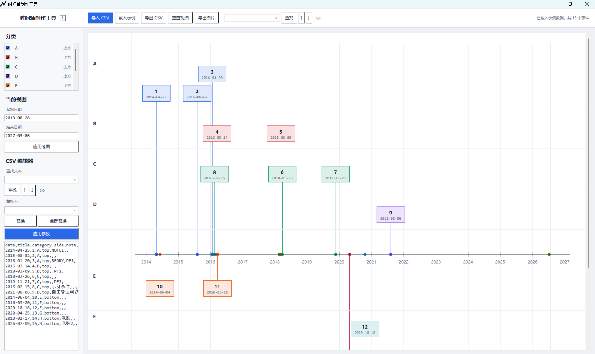

# 桌面版时间轴制作工具

## 简介

这是一个基于 Python 和 Tkinter 的桌面版时间轴制作工具，借助 AI 开发。

项目包含以下主要功能：

- 通过导入 CSV 文件将事件呈现在时间轴上
- 导入和导出 CSV 文件
- CSV 数据内容的增删改查及时间轴上事件信息的实时更新
- 数据文本查找替换和事件查找功能
- 缩放和拖拽时间轴
- 事件类别的泳道显示和颜色区分
- 任意数量事件类别（及此类别内所有事件）的隐藏和显示
- 事件上鼠标悬浮查看更多信息
- 导出 PNG 图片
- 导出 SVG 矢量图
- 重置时间轴视图
- 未保存修改退出提醒

对于这个工具可以：

- 下载 Releases 中的 exe 文件直接运行（无需安装 Python）
- 下载或克隆到本地后直接运行 `timelineMakerDesktop.exe`，或点击 `run.bat`（需安装 Python）运行源码。
- 下载或克隆源码进行二次开发

CSV 数据格式要求必须有：

- date（日期）
- title（事件名目）
- category 或 group（分类）（二选一）
- side（轴区）

其它字段按需添加，如 note（备注）、platform（平台）、source（来源）、author（作者）等。

```csv
date,title,category,side,note,platform,source,author
2014-04-25,1,A,top,NOTE1,aaaaaa,c,b
2015-08-02,2,A,top,对事件2的备注,,
2016-01-20,3,A,top,BERRY,PF1,
2016-03-14,4,B,top,,,
2018-03-09,5,B,top,,PF2,
2018-03-26,6,C,top,,,
2019-11-21,7,C,top,,PF3,
2016-02-15,8,C,top,示例事件,,示例来源
2021-08-06,9,D,top,自由备注可以直接写；还可以使用附加列。,,示例来源
2014-06-04,10,E,bottom,,,
```

顺序随意，例如：

```csv
date,title,side,note,platform,source,author,category
2014-04-25,1,top,NOTE1,aaaaaa,c,b,B
```

```csv
title,side,date,group
1,top,2014-04-25,B
```

## 截图



## Acknowledgements

This project uses the following open-source projects:

- Python (PSF License)
  https://www.python.org/

- Tkinter (Python Standard Library)
  https://docs.python.org/3/library/tkinter.html

- Pillow (MIT-CMU License)
  https://github.com/python-pillow/Pillow

- PyInstaller (GPL-2.0-or-later with Bootloader Exception)
  https://github.com/pyinstaller/pyinstaller

The respective projects remain subject to their own licenses.

## License

This project is licensed under the MIT License.

See the LICENSE file for details.