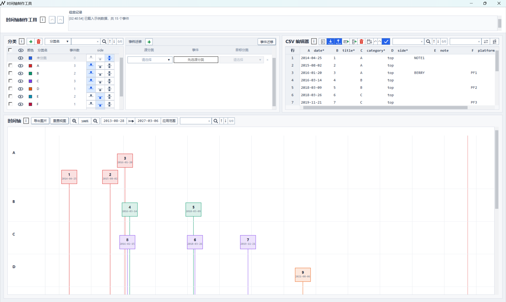

# 桌面版时间轴制作工具

当前版本：2.0.0

这是一个基于 Python 和 Tkinter 的桌面版时间轴制作工具，借助 AI 开发。它以 CSV 为数据源，在桌面界面中完成事件编辑、分类管理、事件迁移和时间轴可视化。

## 主要功能

### CSV 编辑器

- 导入 CSV、载入示例、导出 CSV
- 直接在表格中编辑单元格
- 新增事件行、新增字段列
- 点击行号或列头选择整行 / 整列
- 行列预删除：先灰显，点击“应用修改”后正式删除
- 再次点击已预删除的行头 / 列头可取消预删除
- 必需字段保护
- 按日期从早到晚排序
- CSV 文本查找、上一个 / 下一个匹配
- 替换当前、全部替换
- 应用前的数据校验与非法单元格定位
- CSV 草稿独立撤销 / 重做

CSV 中的修改在点击“应用修改”前属于草稿，不会立即改变正式时间轴数据。

### 分类管理

- 新建、删除分类
- 双击分类名重命名
- 分类显示 / 隐藏
- 批量显示 / 隐藏所选分类
- 空分类灰显但保持可操作
- 按显示状态、分类名、事件数、side 筛选
- 事件数支持 `>0` 筛选非空分类
- 筛选结果自动选择、高亮并可逐项定位
- 分类 side 支持上侧、下侧、无限制三种状态

### 事件迁移

- 在分类之间迁移部分事件
- 一次选择“所有事件”
- 以“所有分类”为源，将多个分类中的事件统一迁入一个目标分类
- 支持多行迁移计划
- 迁移后同步更新 CSV、分类区和时间轴
- 空分类不会因为迁移而自动删除

### 时间轴

- 分类泳道与颜色区分
- 事件上下双侧显示
- 事件悬浮显示详细信息
- 按住事件高亮
- 时间轴事件搜索和逐项定位
- 手动设置时间范围
- 重置视图
- 拖动画布横向移动时间范围
- 二维缩放和缩放百分比
- 导出 SVG / PNG

鼠标操作：

- 滚轮：纵向滚动
- `Shift + 滚轮`：横向移动
- `Ctrl + 滚轮`：横向缩放时间范围
- `Ctrl + Shift + 滚轮`：二维缩放

### 两套撤销 / 重做

工具将 CSV 草稿和正式数据版本分开管理。

- CSV 区撤销 / 重做：只处理尚未应用的 CSV 草稿
- 页面顶部全局撤销 / 重做：只处理已经正式生效的数据操作

正式操作包括应用 CSV 修改、分类新建 / 删除 / 重命名、分类 side 修改和事件迁移等。

查找、筛选、定位、显示 / 隐藏、滚动和缩放等浏览操作不进入全局历史。

`Ctrl+Z` / `Ctrl+Y` 根据最近一次鼠标点击区域决定作用域：

- 最近点击 CSV 区：操作 CSV 草稿历史
- 最近点击 CSV 区外：操作全局正式历史

## CSV 格式

CSV 必须包含以下字段：

- `date`：日期
- `title`：事件名称
- `category` 或 `group`：分类，二选一
- `side`：时间轴侧别

这些必需字段会在表头以 `*` 标记，并受到删除保护。

可以按需增加其它字段，例如：

- `note`
- `platform`
- `source`
- `author`

示例：

```csv
date,title,category,side,note,platform,source,author
2014-04-25,1,A,top,NOTE1,aaaaaa,c,b
2015-08-02,2,A,top,对事件2的备注,,,
2016-01-20,3,A,top,BERRY,PF1,,
2016-03-14,4,B,top,,,,
2018-03-09,5,B,top,,PF2,,
2018-03-26,6,C,top,,,,
2019-11-21,7,C,top,,PF3,,
2016-02-15,8,C,top,示例事件,,示例来源,
2021-08-06,9,D,top,自由备注可以直接写；还可以使用附加列。,,示例来源,
2014-06-04,10,E,bottom,,,,
```

字段顺序不限，例如：

```csv
date,title,side,note,platform,source,author,category
2014-04-25,1,top,NOTE1,aaaaaa,c,b,B
```

也可以使用 `group`：

```csv
title,side,date,group
1,top,2014-04-25,B
```

## 运行

可以：

- 下载 Releases 中的 exe 文件直接运行（无需安装 Python）
- 下载或克隆到本地后直接运行 `timelineMakerDesktop.exe`，或点击 `run.bat`（需安装 Python）运行源码。
- 下载或克隆源码进行二次开发

## 截图



## Acknowledgements

This project uses the following open-source projects:

- Python (PSF License)  
  https://www.python.org/

- Tkinter (Python Standard Library)  
  https://docs.python.org/3/library/tkinter.html

- Pillow (MIT-CMU License)  
  https://github.com/python-pillow/Pillow

- PyInstaller (GPL-2.0-or-later with Bootloader Exception)  
  https://github.com/pyinstaller/pyinstaller

The respective projects remain subject to their own licenses.

## License

This project is licensed under the MIT License.

See the LICENSE file for details.
